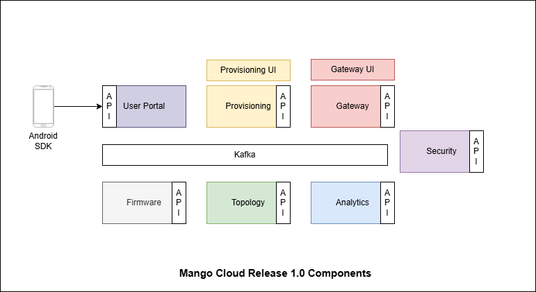

# MangoCloud SDK Docker Compose

### Overview
With the provided Docker Compose files you can instantiate a deployment of the OpenWifi microservices and related components. The repository contains a self-signed certificate and a TIP-signed gateway certificate which are valid for the `*.wlan.local` domain. You also have the possibility to either generate and use Let's Encrypt certs or provide your own certificates.

### Mango Cloud Components


This diagram shows how the full Mango Cloud stack is connected in Docker Compose:
- `owgw-ui` and `owprov-ui` are user-facing web interfaces.
- Core backend services (`owgw`, `owsec`, `owfms`, `owprov`, `owanalytics`, `owsub`, and `network-topology`) handle controller, security, firmware, provisioning, analytics, subscriber, and topology workflows.
- `kafka` is used for inter-service messaging and `postgresql` stores persistent data.

### Build Your Own Images
All Mango Cloud component repositories are public. You can clone these repos, build your own Docker images, and update image references/tags in the compose files for custom deployments.

- `owgw`: https://github.com/routerarchitects/ra-wlan-cloud-ucentralgw/tree/release/v1.0.0
- `owgw-ui`: https://github.com/routerarchitects/ra-wlan-cloud-ucentralgw-ui/tree/release/v1.0.0
- `owprov`: https://github.com/routerarchitects/ra-wlan-cloud-owprov/tree/release/v1.0.0
- `owprov-ui`: https://github.com/routerarchitects/ra-wlan-cloud-owprov-ui/tree/release/v1.0.0
- `owanalytics`: https://github.com/routerarchitects/ra-wlan-cloud-analytics/tree/release/v1.0.0
- `owsec`: https://github.com/routerarchitects/ra-wlan-cloud-ucentralsec/tree/release/v1.0.0
- `owfms`: https://github.com/routerarchitects/ra-wlan-cloud-ucentralfms/tree/release/v1.0.0
- `owsub` (user portal): https://github.com/routerarchitects/ra-wlan-cloud-userportal/tree/release/v1.0.0
- `network-topology`: https://github.com/routerarchitects/ra-openlan-nw-topology/tree/release/v1.0.0

---
## Local Setup

### Clone repo
```
mkdir openwifi-sdk
cd openwifi-sdk
git clone https://github.com/routerarchitects/mango-cloud-deployment.git
cd mango-cloud-deployment/docker-compose/
git checkout release/v1.0.0
```

### Install Docker and Docker Compose
```
sudo apt install docker.io docker-compose -y
sudo usermod -aG docker $USER
newgrp docker
sudo chown -R $USER:$USER .
```

### Set up image configuration in owfms.env
These settings are used by owgw-ui and owprov-ui to display the device group and device type, and they are also required for firmware upgrades.

Update the firmware bucket settings in owfms.env. This bucket should contain all firmware images and the metadata file required for device upgrades. After completing the setup, verify that the device type and device group are displayed correctly in both owgw-ui and owprov-ui.
```
S3_BUCKETNAME=<firmware-bucket-name>
S3_REGION=<aws-region>
S3_SECRET=<s3-secret-key>
S3_KEY=<s3-access-key>
S3_BUCKET_URI=s3.<aws-region>.amazonaws.com/<firmware-bucket-name>
FIRMWAREDB_MAXAGE=365  # Firmware image expiry time in days. Default value is 90.
```

### Set up email verification in owsec.env


The Security service (owsec) uses an email account to send subscriber verification emails. To enable this feature, configure the email settings in owsec.env.

If you are using Gmail, create an App Password for the email account that will be used to send verification emails. You can generate it from:

[Google App Passwords](https://myaccount.google.com/apppasswords)

After generating the App Password, update the following values in owsec.env:

```
MAILER_ENABLED=true
MAILER_HOSTNAME=smtp.gmail.com
MAILER_USERNAME=<Email used to create the app-password>
MAILER_PASSWORD=<app-password>
MAILER_SENDER=Sender Name <sender email>
MAILER_PORT=587
MAILER_TEMPLATES=$OWSEC_ROOT/templates
```
### Update certificates
Certificates are required for secure communication between devices and the controller (owgw). A common CA/Issuer must be used to generate both the controller (server) certificates and the device certificates.

Use the guide available in [mango_cloud_cert_generation](https://github.com/routerarchitects/mango_cloud_cert_generation)
 to generate and transfer the required certificates.

After generating the certificates, update the following files in the certs/ directory with the newly generated certificates:
```
clientcas.pem
issuer.pem
root.pem
websocket-cert.pem
websocket-key.pem
```

### Start OpenWiFi Docker Stack (Local)
```
docker-compose down --remove-orphans
docker-compose up -d
```

### Add local hostname mapping
The local UI URLs use `openwifi.wlan.local`, so add it to `/etc/hosts` on your machine:
```
echo "127.0.0.1 openwifi.wlan.local" | sudo tee -a /etc/hosts
```

### Access Web UI 
```
Controller:
URL: https://openwifi.wlan.local

Provisioning:
URL: https://openwifi.wlan.local:8443

Credentials:
Username: tip@ucentral.com
Password: openwifi
```

---
## Remote Setup
- Create an EC2 Instance
- Choose an instance with at least 8 GB RAM
- Use Ubuntu 22.04.3 LTS or later
- Before starting the remote setup, first complete the local setup steps: clone the repository, install Docker, and configure owfms.env and owsec.env.

### Update security group
In the Security Group, allow these inbound ports:

```
TCP: 22, 80, 443, 5000, 5912, 5913, 8443, 15002, 16001, 16002, 16003, 16004, 16005, 16006, 16007, 16009
```


### Initial Setup
SSH into your instance:
```
ssh -i <your-key.pem> ubuntu@<EC2-PUBLIC-IP>
```


Update packages and install tools:
```
sudo apt update
sudo apt install net-tools certbot -y
```

Choose the public domain name that will be used to access Mango Cloud. Enter only the hostname, without `https://`.
Run:
```
PUBLIC_HOSTNAME=<your-public-domain eg. mangocloud.com>  
echo "$PUBLIC_HOSTNAME"
```

Run
```
bash ./update_openwifi_public_certs.sh
```

Update Hostname References:

Replace all instances of openwifi.wlan.local with your domain:
```
sudo find . -type f -name "*.env" -exec sed -i.bak "s|openwifi\.wlan\.local|$PUBLIC_HOSTNAME|g" {} +
```

Run certbot command:
```
sudo certbot certonly --standalone \
  --key-type rsa \
  --cert-name $PUBLIC_HOSTNAME \
  -d $PUBLIC_HOSTNAME \
  -m your-email@example.com \
  --agree-tos --non-interactive --force-renewal
```
Certs will be created in:
```
/etc/letsencrypt/live/<PUBLIC_HOSTNAME>/
```
If the Let’s Encrypt certificate is generated successfully, run the following commands:

```
cd /home/ubuntu/openwifi-sdk/mango-cloud-deployment/docker-compose

sudo cp /etc/letsencrypt/live/$PUBLIC_HOSTNAME/privkey.pem   certs/restapi-public-key.pem

sudo cp /etc/letsencrypt/live/$PUBLIC_HOSTNAME/fullchain.pem certs/restapi-public-cert.pem

sudo cp /etc/letsencrypt/live/$PUBLIC_HOSTNAME/chain.pem     certs/restapi-public-ca.pem

sudo chown ubuntu:ubuntu certs/restapi-public-*.pem
sudo chmod 664 certs/restapi-public-*.pem
ls -l certs/
```

### Update docker-compose.yml for Remote Setup
For remote setup, after generating the public certificates, update the certificate mount paths in docker-compose.yml for both owgw-ui and owprov-ui.

Replace:
```
- "./certs/restapi-cert.pem:/etc/nginx/restapi-cert.pem"
- "./certs/restapi-key.pem:/etc/nginx/restapi-key.pem"
```
with:
```
- "./certs/restapi-public-cert.pem:/etc/nginx/restapi-cert.pem"
- "./certs/restapi-public-key.pem:/etc/nginx/restapi-key.pem"
```
### Start OpenWiFi Docker Stack
```
docker-compose down --remove-orphans
docker-compose up -d
```

### Access Web UI 
```
Controller:
URL: https://<PUBLIC_HOSTNAME>

Provisioning:
URL: https://<PUBLIC_HOSTNAME>:8443

Credentials:
Username: tip@ucentral.com
Password: openwifi
```


### Automated Let’s Encrypt Certificate Renewal
#### Create the Deploy Hook Script

Note: <PUBLIC_HOSTNAME> in the script below is a placeholder and must be replaced with your actual hostname.

Create the file:
```
sudo tee /usr/local/bin/openwifi-sdk-renew-certs-hook.sh > /dev/null << 'EOF'
#!/bin/bash

LOG_FILE="/var/log/letsencrypt-renewal.log"
CERT_DIR="/home/ubuntu/openwifi-sdk/mango-cloud-deployment/docker-compose/certs"
LE_DIR="/etc/letsencrypt/live/<PUBLIC_HOSTNAME>"

echo "[openwifi-cert-renewal] Certificate renewed at $(date)" > "$LOG_FILE"

cp "$LE_DIR/fullchain.pem" "$CERT_DIR/restapi-public-cert.pem"
cp "$LE_DIR/privkey.pem"   "$CERT_DIR/restapi-public-key.pem"
cp "$LE_DIR/chain.pem"     "$CERT_DIR/restapi-public-ca.pem"

chown ubuntu:ubuntu -R "$CERT_DIR"/restapi-public*.pem
chmod 664 "$CERT_DIR"/restapi-public*.pem

cd /home/ubuntu/openwifi-sdk/mango-cloud-deployment/docker-compose || exit

/usr/bin/docker-compose down
/usr/bin/docker-compose up -d

echo "[openwifi-cert-renewal] Docker Compose restarted at $(date)" >> "$LOG_FILE"
EOF
```

Make it executable:
```
sudo chmod +x /usr/local/bin/openwifi-sdk-renew-certs-hook.sh
```

#### Create the Renewal Wrapper Script

This script checks whether the current certificate will expire within the next 48 hours. If yes, it forces renewal and then runs the deploy hook.
```
sudo tee /usr/local/bin/openwifi-sdk-renew-certs.sh > /dev/null << 'EOF'
#!/bin/bash
set -euo pipefail

CERT_FILE="/etc/letsencrypt/live/<PUBLIC_HOSTNAME>/cert.pem"
HOOK_SCRIPT="/usr/local/bin/openwifi-sdk-renew-certs-hook.sh"
LOG_FILE="/var/log/letsencrypt-renewal.log"

if ! openssl x509 -checkend 172800 -noout -in "$CERT_FILE"; then
  echo "[openwifi-cert-renewal] Certificate expires in less than 48 hours. Renewing at $(date)" >> "$LOG_FILE"
  certbot renew --cert-name <PUBLIC_HOSTNAME> --force-renewal --quiet
  "$HOOK_SCRIPT"
else
  echo "[openwifi-cert-renewal] Certificate is still valid for more than 48 hours. No renewal needed at $(date)" >> "$LOG_FILE"
fi
EOF
```
Make it executable:
```
sudo chmod +x /usr/local/bin/openwifi-sdk-renew-certs.sh
```
#### Set up Cron Job for Automatic Renewal Checks

Edit the root crontab:
```
sudo crontab -e
```

Add this entry:
```
17 */12 * * * /usr/local/bin/openwifi-sdk-renew-certs.sh
```
This checks the certificate every 12 hours and renews it only when less than 48 hours remain before expiry.

Check the crontab:
```
sudo crontab -l
```
#### Test the Renewal Logic

To test whether the script runs correctly:
```
sudo bash /usr/local/bin/openwifi-sdk-renew-certs.sh
```
To verify the current certificate expiry date:
```
sudo openssl x509 -enddate -noout -in /etc/letsencrypt/live/<PUBLIC_HOSTNAME>/cert.pem
```
